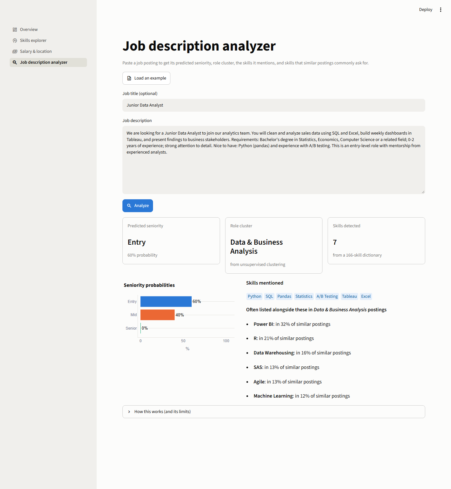
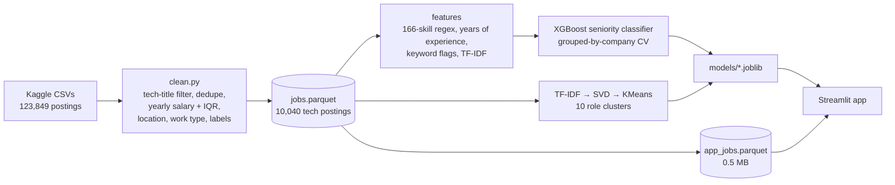
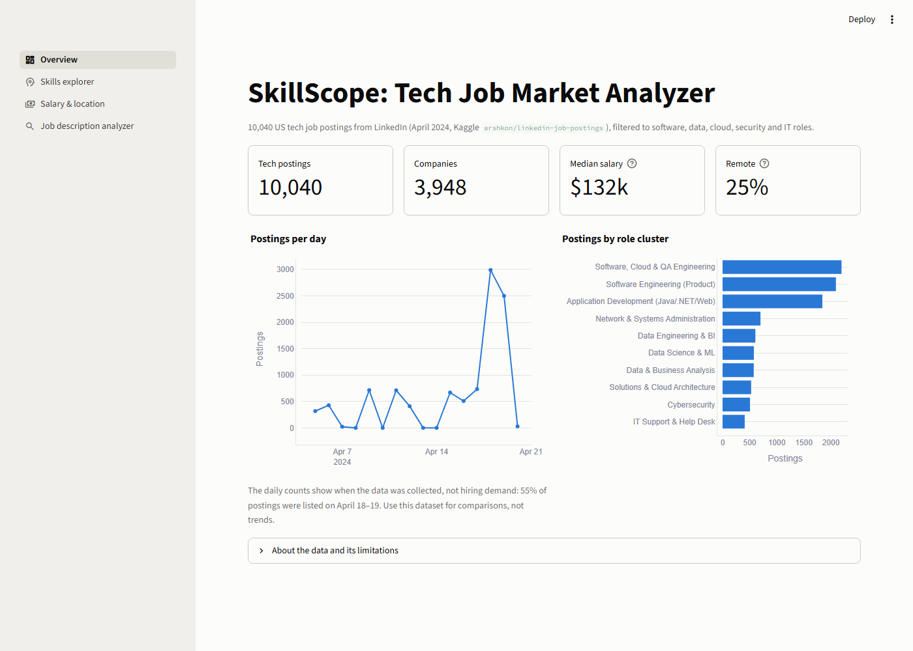
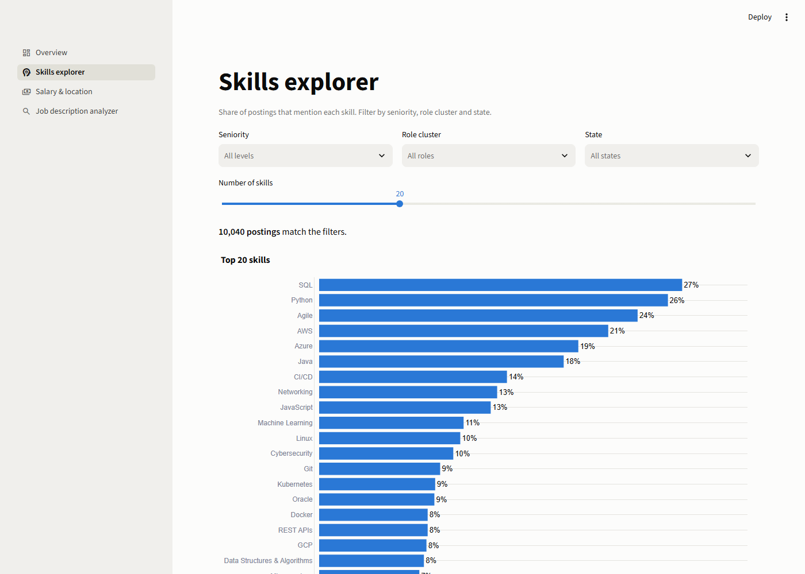
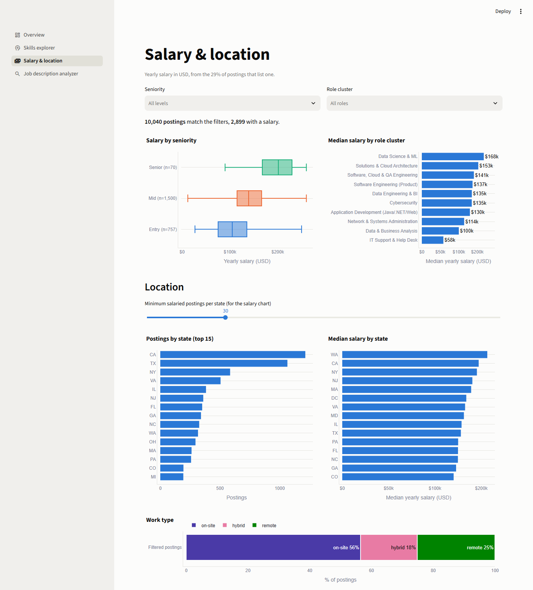

# SkillScope: Tech Job Market Analyzer

[](https://github.com/KlRAAA/SkillScope-Tech-Job-Market-Analyzer/actions/workflows/tests.yml)

An end-to-end data analysis and machine learning project on **10,040 US tech job postings** from LinkedIn (April 2024). It answers which skills are in demand, how requirements and pay differ by seniority, role and location, and ships a **Streamlit app** that analyzes any pasted job description.

**Live app:** https://skillscope-tech-job-market-analyzer.streamlit.app



## What it does

1. **Exploratory analysis:** the skills, salaries, locations and work types behind tech hiring ([`03_eda.ipynb`](notebooks/03_eda.ipynb)).
2. **Seniority classifier:** predicts *Entry / Mid / Senior* from a posting's title and description ([`04_seniority_model.ipynb`](notebooks/04_seniority_model.ipynb)).
3. **Role clustering:** groups postings into 10 role types, such as Data Science & ML, Cybersecurity or IT Support, without labels ([`05_role_clustering.ipynb`](notebooks/05_role_clustering.ipynb)).
4. **Dashboard:** an overview, a skills explorer, salary & location pages, and a job description analyzer that returns seniority, role type, detected skills and *"skills commonly listed alongside these that you didn't mention"*.

## Pipeline



## Key findings

- **Fundamentals beat frameworks.** SQL (27%) and Python (26%) are the most-requested skills, followed by Agile and cloud (AWS 21%, Azure 19%). React appears in only 7% of tech postings.
- **Skills come in stacks.** 66% of Docker postings also mention Kubernetes, 73% of GCP postings also mention AWS, and 64% of ML postings mention Python.
- **Role matters more than location for pay.** Median salary ranges from $58k (IT Support) to $168k (Data Science & ML), a spread of about $110k. Across states the spread is about $49k (Washington $157k vs. Minnesota $108k).
- **AI/ML skills pay the most.** Postings that mention LLMs, PyTorch or deep learning have medians of $176–188k, vs. $132k overall. This is correlation, not causation: these skills cluster in senior, high-cost roles.
- **IT Support is the main entry point** (75% Entry). Solutions & Cloud Architecture is the most senior role type (9% Entry).
- **Entry roles are the most on-site** (64%, vs. 52–54% for Mid and Senior), so remote work is less available to newcomers.

## Model results

### Seniority classifier

Test set = ~20% of postings from **companies never seen in training** (`StratifiedGroupKFold` by company). The main metric is **macro F1**, because Senior is only 2.7% of labeled postings.

| Model | CV macro F1 (5 grouped folds) | Test macro F1 |
|---|---|---|
| Baseline (always "Mid") | – | 0.262 |
| Logistic Regression | 0.541 ± 0.018 | – |
| Linear SVM | 0.544 ± 0.018 | – |
| **XGBoost** (TF-IDF + hand-crafted features) | **0.567 ± 0.025** | **0.607** |
| XGBoost without the job title | 0.502 | 0.548 |

Per class (test): Mid F1 0.79, Entry 0.58, Senior 0.45 (precision 0.80, recall 0.32). Between training runs, results vary by about ±0.03, because the test set has only 38 Senior postings.

What the model uses (SHAP): *support, assist, troubleshooting* → Entry; *senior, sr, engineer* → Mid; *lead, leadership, director, strategy* → Senior. Without the title it still scores about twice the baseline, so most of the signal comes from the description.

### Role clusters (k = 10)

| Cluster | Postings | Signature skills | Median salary |
|---|---|---|---|
| Software, Cloud & QA Engineering | 2,198 | DevOps, test automation, databases | $141k |
| Software Engineering (Product) | 2,094 | broad stacks | $137k |
| Application Development (Java/.NET/Web) | 1,844 | Java, C#, React, Angular, REST | $130k |
| Network & Systems Administration | 700 | Cisco, firewalls, VMware | $114k |
| Data Engineering & BI | 606 | data warehousing, Power BI, Databricks | $135k |
| Data Science & ML | 578 | PyTorch, TensorFlow, deep learning | $168k |
| Data & Business Analysis | 576 | Excel, Tableau, Power BI | $100k |
| Solutions & Cloud Architecture | 528 | microservices, cloud | $153k |
| Cybersecurity | 507 | CISSP, SIEM, penetration testing | $135k |
| IT Support & Help Desk | 409 | Active Directory, Microsoft 365, ServiceNow | $58k |

## Design decisions worth knowing

- **Grouped split by company.** Companies reuse posting templates, so a random split lets near-duplicates leak into the test set. All of a company's postings stay on one side.
- **Company names are removed from the text.** 54% of descriptions mention their own company, and some companies label almost everything one way (e.g. 83% of one staffing agency's postings are Entry). Without this, the model could learn the company instead of the seniority.
- **Feature leakage control.** TF-IDF, imputer and scaler are fitted inside the sklearn `Pipeline`, on training folds only. The stateless features (skills, years, flags) are computed once and cached.
- **Boilerplate stop words for clustering.** Without them, 2 of 10 clusters (≈3,300 postings) formed around equal-opportunity/benefits templates instead of roles.
- **Label mapping.** LinkedIn levels are grouped as Entry = Internship + Entry + Associate, Mid = Mid-Senior, Senior = Director + Executive. The alternatives are compared in [`02_cleaning.ipynb`](notebooks/02_cleaning.ipynb).

## Data and limitations

- **Source:** Kaggle [`arshkon/linkedin-job-postings`](https://www.kaggle.com/datasets/arshkon/linkedin-job-postings), 123,849 postings from all industries, filtered by title to 10,820 tech postings (10,040 after deduplication).
- **A snapshot, not a trend:** 99% of postings were listed in April 2024, and 55% on just two days (the collection dates). The data supports comparisons, not time trends.
- **US-heavy:** California and Texas hold 23% of postings, and 17% only say "United States".
- **Salary** is disclosed in only 29% of postings. It is converted to yearly USD, with outliers removed by the IQR rule (which also removes some genuine salaries above $260k).
- **Noisy labels:** LinkedIn's experience level is missing for 29% of postings and set inconsistently by employers. "Mid-Senior level" mixes both levels, and there are only 191 Senior postings.
- **Bag-of-words models have no context:** "mentorship from *senior* analysts" pushes an entry-level posting towards Mid.
- **"On-site"** means "not marked remote and doesn't mention hybrid". There is no explicit on-site field.

## Screenshots

| Overview | Skills explorer |
|---|---|
|  |  |



All analysis charts are in [`reports/figures/`](reports/figures), and all metrics are in [`reports/metrics.json`](reports/metrics.json).

## Run it locally

Requires Python 3.11+ (developed on 3.14) and a Kaggle API token in `~/.kaggle/kaggle.json` ([create one here](https://www.kaggle.com/settings)).

```bash
python -m venv .venv
.venv\Scripts\activate          # macOS/Linux: source .venv/bin/activate
pip install -r requirements.txt
```

**Just the app** (the trained models and app data are committed):

```bash
streamlit run app/streamlit_app.py
```

**Rebuild everything from the raw data:**

```bash
python -m src.data.download               # ~160 MB download from Kaggle
python -m src.data.clean                  # -> data/processed/jobs.parquet
python -m src.features.pipeline           # cached model features (~3 min)
python -m src.models.train_classifier     # seniority model (~40 min on 4 cores)
python -m src.models.train_clusters       # role clusters (~2 min)
python -m src.data.app_sample             # -> data/processed/app_jobs.parquet
```

**Tests and linting:**

```bash
pytest
ruff check src app tests notebooks
black --check src app tests
```

## Project structure

```
data/raw/            Kaggle CSVs (git-ignored)
data/processed/      jobs.parquet (git-ignored) and app_jobs.parquet (committed)
notebooks/           01_data_overview, 02_cleaning, 03_eda, 04_seniority_model, 05_role_clustering
src/data/            download, clean, app_sample
src/features/        skills (166-skill regex), text (TF-IDF, years, flags), pipeline
src/models/          train_classifier, train_clusters, predict, estimators
src/viz.py           shared, colorblind-checked chart style
app/                 Streamlit app and its runtime requirements
models/              trained pipelines (.joblib)
reports/             figures, screenshots, metrics.json
tests/               pytest suite (run in CI on every push)
```

## Tech stack

pandas · NumPy · PyArrow · scikit-learn · XGBoost · SHAP · matplotlib · Plotly · Streamlit · pytest · black · ruff · GitHub Actions
